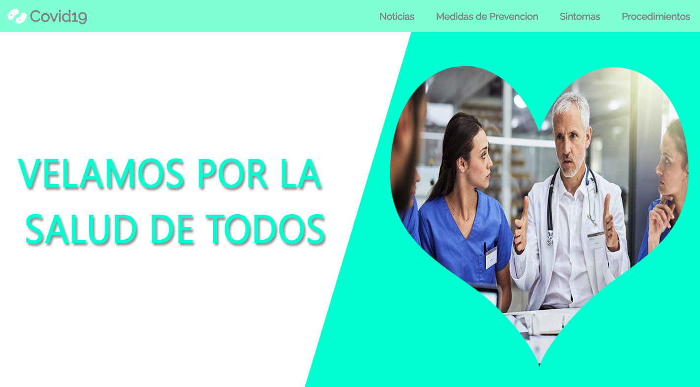

Página Informátiva COVID-19
---

Para el desarrollo del sitio utilizamos lo siguientes recursos:
---

1.	Lenguajes de programación (Html5 - Css3 - JavaScript)  
2.	Fuentes→ [Google Fonts](https://fonts.google.com/)
3.	Iconos → [Font aweson](https://fontawesome.com/)
4.  Imagenes → [Ilustrator](https://undraw.co/illustrations)

Css3
---

4.	Flexbox → [Documentación de Flexbox ](https://www.w3schools.com/css/css3_flexbox.asp)
5.	Responsive Desing → [Documentación de Resposive Desing](https://www.w3schools.com/css/css_rwd_intro.asp)
6.	MediaQueries → [Documentación de MediaQueries](https://www.w3schools.com/css/css3_mediaqueries.asp)

